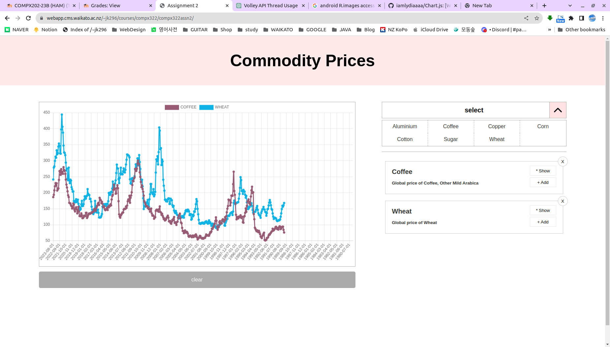

# Chart.js
[Waikato Univ. COMPX322 Assignment] Chart.js, API(alphavantage) project

 
<h2>
  Object Oriented JavaScript : Commodity Prices Widget   
  with Chart.js
</h2>

  <h3>- TOOL -</h3>
  
   
  
  <h3>- FRONTEND -</h3>
  
   
	 
	 

   
  
 

  

 

